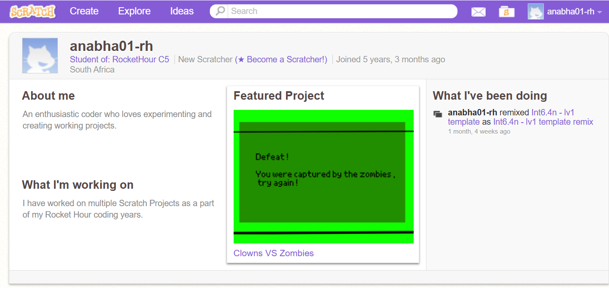

# Early Coding Years

### Overview:
This repository contains a collection of my earliest coding work, documenting the beginning of my programming journey. It includes projects created while learning Scratch, LiveCode, and early checkpoint-based programming tasks.

These projects represent my transition from block-based programming to my first experience with text-based coding.

### Timeline:
| Stage | Time Period | Description |
|---|---:|---|
| Scratch | 2020–2023 | My introduction to coding through block-based programming, animations, and simple games. |
| LiveCode | 2023–2024 | My first experience with text-based programming and writing structured commands. |
| Checkpoint Projects | 2020–2024 | Challenge-based projects used to practise logic, sequencing, variables, conditions, and user interaction. |
| Moved to GitHub | 2026 | Organised and uploaded to GitHub as part of my coding portfolio. |

### Skills & Topics Covered:
- Computational thinking
- Sequencing and step-by-step logic
- Variables and basic data storage
- Conditional statements
- Loops and repetition
- Events and user interaction
- Simple game design
- Creative problem-solving
- Debugging beginner-level code
- Building confidence with programming tools

### Repository Structure:
#### **EARLY_CODING_YEARS:**
- **01. SCRATCH:** Early block-based coding projects
- **02. LIVECODE:** First text-based programming projects
- **03. PROJECTS:** Checkpoint and challenge-based coding projects I've done over the years

------------------------------------------------------------------------------------------------
## **NOTE:**
**The projects in this repository were created earlier in my coding journey and were later moved to GitHub in 2026 for organisation and portfolio documentation. Therefore, the GitHub commit dates may reflect the upload date rather than the original project creation dates.**

SCRATCH START DATE PROOF:

